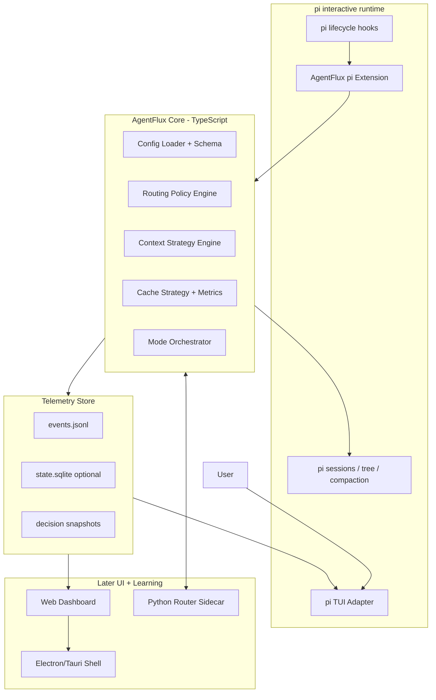
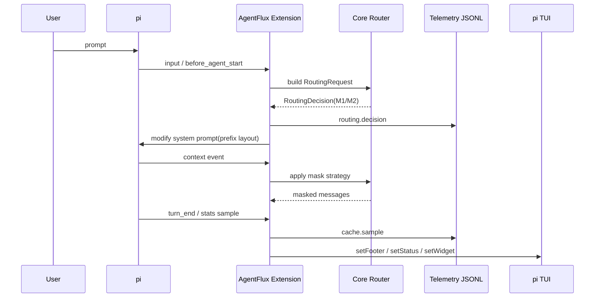
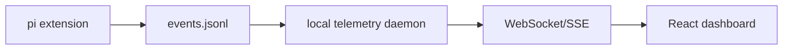
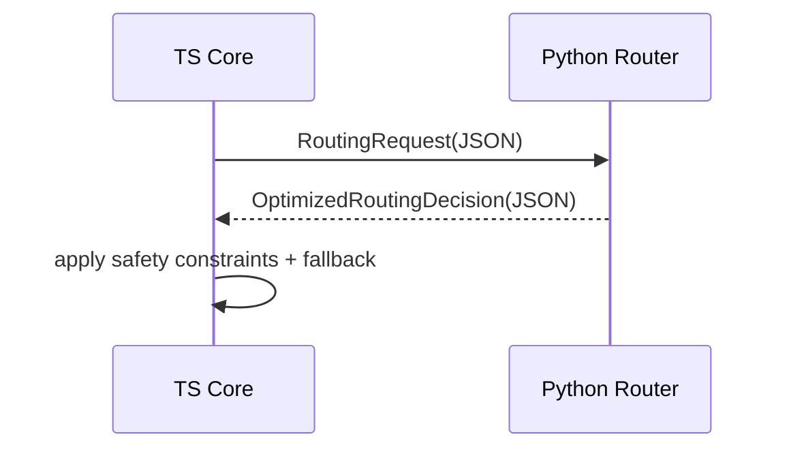

# 11 - 系统架构规划

> 历史架构规划。当前代码边界见 [00](00-overview.md) 与 [28](28-agent-workstyle-redesign.md)。

## 决策结论

AgentFlux 采用**分层架构**:

1. **pi extension 验证层**:先在真实 pi TUI 内验证 cache/context/routing 是否有效。
2. **AgentFlux Core**:纯 TypeScript 的路由、配置、模式编排核心,不绑定 UI。
3. **Telemetry Store**:统一事件模型(JSONL/SQLite),同时服务 TUI、Web、Electron。
4. **UI Adapters**:pi TUI 是第一个 adapter;后续 Web/Electron 复用同一状态层。
5. **Python Router Sidecar**:Phase 3 才引入,只负责 ILP/RL/复杂度分析,不碰 UI。

核心原则:**先用 pi 做最小验证,但从第一天保留 Web/Electron 的数据边界。**

---

## 一、总体架构



### 为什么这样分层

- **pi extension**负责接入 pi 生命周期和 TUI,但不承载复杂策略。
- **Core**负责可测试逻辑,未来可被 CLI/Web/Electron 复用。
- **Store**是关键抽象:如果没有统一事件模型,后续 Web/Electron 会变成重写。
- **Python sidecar**延后,避免 Phase 1 就跨语言复杂化。

---

## 二、模块边界

### 1. `packages/pi-extension`

职责:
- 注册 pi hooks:`before_agent_start`,`context`,`session_before_compact`,`session_before_fork`,`model_select`
- 注册命令:`/flux`,`/flux mode`,`/flux why`,`/flux budget`,`/flux settings`
- 调用 Core 做路由决策
- 用 pi TUI adapter 渲染状态
- 写 telemetry events

不做:
- 不实现复杂路由算法
- 不直接写 Web API
- 不保存业务状态到散落文件

### 2. `packages/core`

职责:
- 配置 schema 与验证
- 六模式 M1–M6 的抽象定义
- 三维度 A/B/C/D 的校验
- 路由 policy:
  - Phase 1:规则路由
  - Phase 2:静态复杂度路由
  - Phase 3:Python sidecar 结果融合
- context/cache 策略:
  - prefix layout
  - mask
  - compact/fork/handoff 决策

接口示例:

```ts
interface RoutingRequest {
  cwd: string;
  userPrompt: string;
  taskSignals: TaskSignals;
  budget: BudgetConstraint;
  sessionStats: SessionStats;
  config: AgentFluxConfig;
}

interface RoutingDecision {
  mode: "M1" | "M2" | "M3" | "M4" | "M5" | "M6";
  confidence: number;
  reason: string[];
  expected: {
    costTier: "low" | "medium" | "high";
    latencyTier: "low" | "medium" | "high";
    accuracyTier: "low" | "medium" | "high";
  };
  actions: RoutingAction[];
  fallback: "M1" | "M2";
}
```

### 3. `packages/telemetry`

职责:
- 统一事件模型
- JSONL writer
- 可选 SQLite 聚合
- WebSocket/SSE feed(Phase 2+)

事件示例:

```json
{
  "type": "routing.decision",
  "ts": 1782331234567,
  "sessionId": "...",
  "turnId": "...",
  "mode": "M2",
  "confidence": 0.82,
  "reason": ["diff-size:medium", "verification-needed", "budget:balanced"],
  "expected": { "costTier": "medium", "latencyTier": "medium", "accuracyTier": "high" }
}
```

```json
{
  "type": "cache.sample",
  "ts": 1782331234567,
  "sessionId": "...",
  "cacheRead": 42000,
  "cacheWrite": 6000,
  "input": 9000,
  "contextPercent": 0.43,
  "costUsd": 0.18
}
```

### 4. `packages/ui-pi`

职责:
- footer/status/widget/overlay 渲染
- `/flux` 命令面板
- route inspector
- cache ledger 简图
- subagent lanes

只消费 `telemetry` 和 `core` 输出,不直接做决策。

### 5. `packages/ui-web`(后续)

职责:
- 读取 telemetry feed
- 提供更大画布:拓扑图、时间轴、成本账本、对比分析
- 初期只读;后期可发控制命令

### 6. `packages/router-python`(Phase 3)

职责:
- ILP 预算优化(BAMAS 风格)
- RL 经验路由(EvoRoute 风格)
- 代码图复杂度分析(RGAO 风格)

通信:
- 初期 stdio JSON
- 如果 Web UI 需要共享,升级为 local HTTP/WebSocket

---

## 三、推荐目录结构

```text
AgentFlux/
├── docs/
├── packages/
│   ├── core/
│   │   ├── src/config/
│   │   ├── src/routing/
│   │   ├── src/context/
│   │   └── src/cache/
│   ├── pi-extension/
│   │   ├── src/index.ts
│   │   ├── src/commands/
│   │   ├── src/hooks/
│   │   └── src/adapters/
│   ├── ui-pi/
│   │   ├── src/footer.ts
│   │   ├── src/widgets.ts
│   │   └── src/overlays/
│   ├── telemetry/
│   │   ├── src/events.ts
│   │   ├── src/jsonl.ts
│   │   └── src/sqlite.ts
│   ├── ui-web/              # Phase 2+ optional
│   └── router-python/        # Phase 3+
├── examples/
├── fixtures/
└── .pi/
    └── extensions/agentflux/ # local dev symlink target
```

### 为什么用 monorepo

- `core` 和 `telemetry` 可被 TUI/Web/Electron 复用
- pi extension 可以快速开发,不用 npm 发布也能本地 symlink
- 后续 Electron 直接打包 `ui-web` + local daemon,不重写业务逻辑

---

## 四、运行时数据流

### Phase 1:pi TUI 验证流



### Phase 2:Web read-only dashboard



初期 Web 只读,避免安全和权限复杂度。等 read-only dashboard 有价值,再允许 Web 发送控制命令。

### Phase 3:Python sidecar 决策



TS Core 始终保留最终裁决权,Python 只提供建议,避免 sidecar 崩溃导致 agent 不可用。

---

## 五、最小验证路径

先验证四个关键假设:

| 假设 | 验证方式 | 成功标准 |
|---|---|---|
| cache stats 可实时拿到 | footer 显示 cacheRead/cacheWrite/context% | 连续 turn 后数字更新 |
| context mask 可控 | `context` hook 删除旧 tool result | provider request token 下降,任务不崩 |
| subagent Windows 可用 | 跑通 pi `examples/extensions/subagent` | 子进程 spawn/abort/usage 正常 |
| telemetry 可复用 | 写 events.jsonl 并用小脚本 tail | TUI 与后续 Web 能消费同一事件 |

**只有这四点过了,再继续 Web/Electron。**

---

## 六、阶段化架构路线

### V0:pi-only probe(1–3 天)

- 单文件 extension
- footer:mode/cache/context/cost
- events.jsonl
- 不引入 monorepo

目的:验证最硬的假设。

### V1:Phase 1 MVP(1–2 周)

- monorepo 建好
- core/config/cache/mask
- `/flux` 命令面板
- subagent 适配
- pi TUI route inspector

目的:用户在 pi 内真实可用。

### V2:Web read-only dashboard(2–4 周)

- telemetry daemon
- React dashboard
- 拓扑图/成本账本/时间轴
- 不控制 pi,只观察

目的:验证大屏 UI 是否真的带来价值。

### V3:Web control plane / Electron shell(后续)

- Web 可发控制命令(mode override,budget limit,agent pause)
- Electron/Tauri 打包
- 多项目/多 session 管理
- 原生通知、托盘、后台 daemon

目的:产品化。

---

## 七、架构上的关键取舍

### 1. 为什么不是先 Electron

Electron 适合 aionui 这种"统一管理 20+ agent"的壳,但 AgentFlux 初期核心假设是 cache/context/routing 是否有效。先 Electron 会把 80% 精力耗在壳和跨平台打包上,而不是验证核心价值。

### 2. 为什么必须先设计 Web/Electron 数据边界

如果 Phase 1 的 TUI 直接读散落变量,后续 Web 必然重写。统一 telemetry event 模型能确保:
- TUI 是第一个 viewer
- Web 是第二个 viewer
- Electron 只是 Web 的包装
- 数据采集只写一次

### 3. 为什么 Python sidecar 不进 Phase 1

Phase 1 的路由主要是规则和阈值,TS 足够。Python 的优势在 ILP/RL/图算法,这些是 Phase 3 的护城河,不是 MVP 的必要条件。

---

## 八、完成标准

AgentFlux 的架构规划完成,必须满足:

- [x] 能解释 pi extension、core、telemetry、UI、Python sidecar 的边界
- [x] 能从 pi TUI 平滑扩展到 Web/Electron
- [x] 不把 UI 状态锁死在 pi extension 内
- [x] 有最小验证路径
- [x] 有明确不做 Electron-first 的理由

下一步:先实现 V0 probe,验证 cache stats + footer + telemetry。
